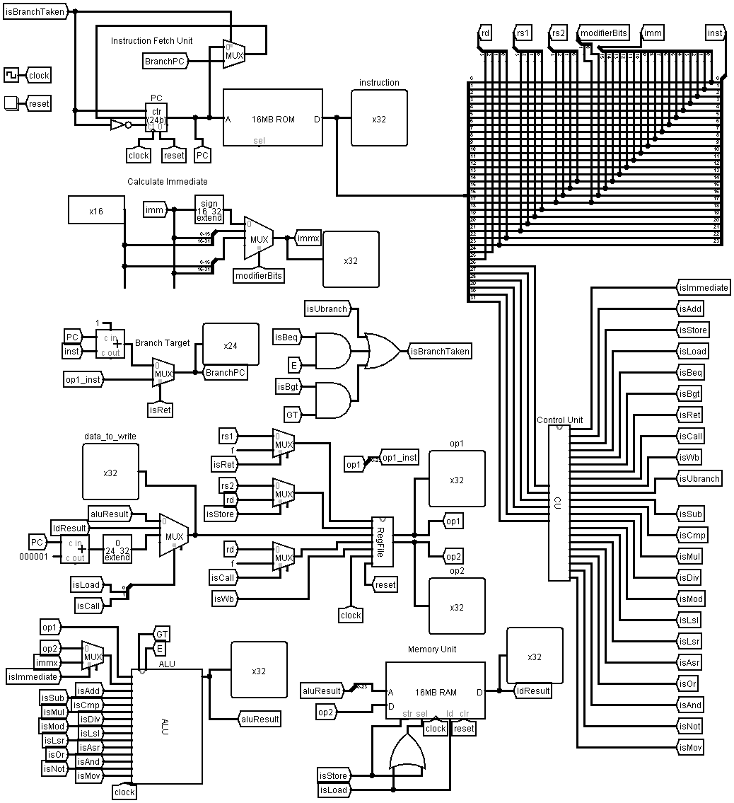
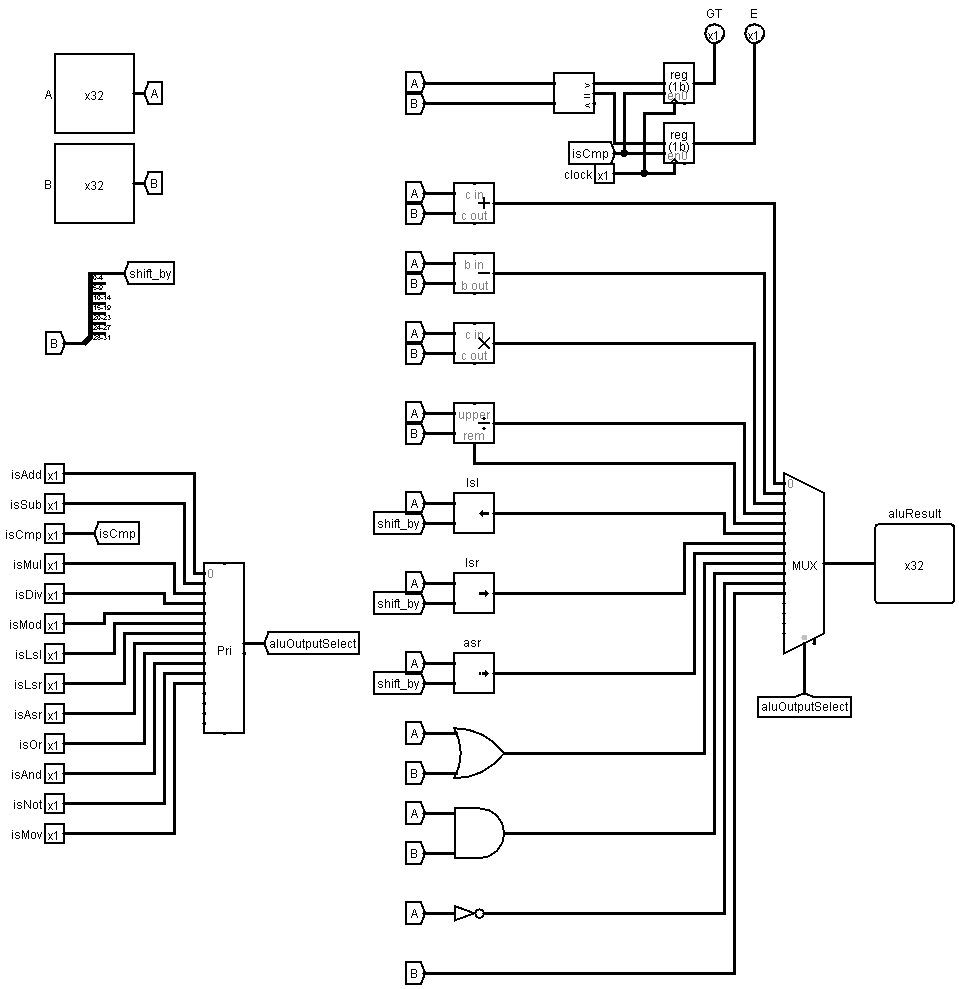
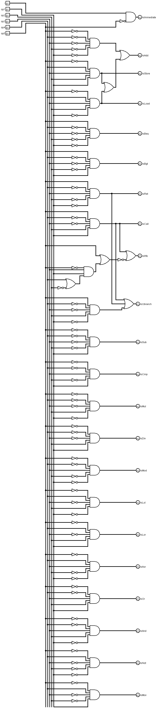
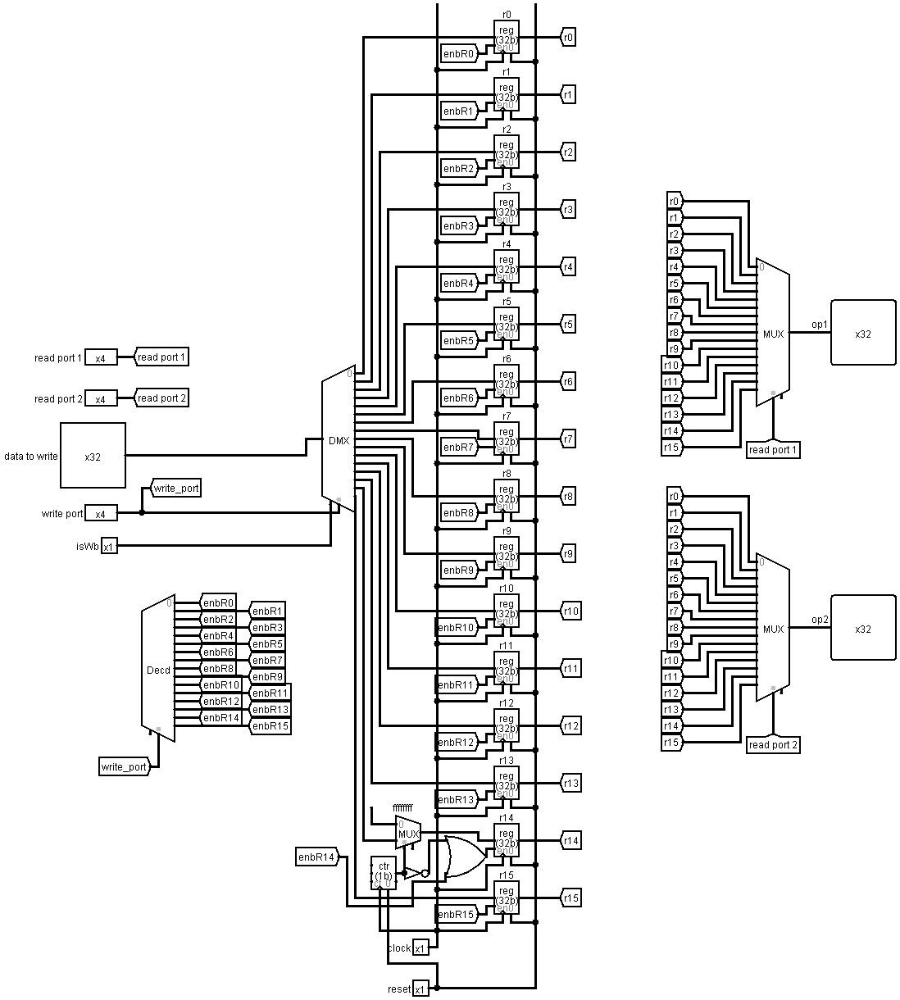
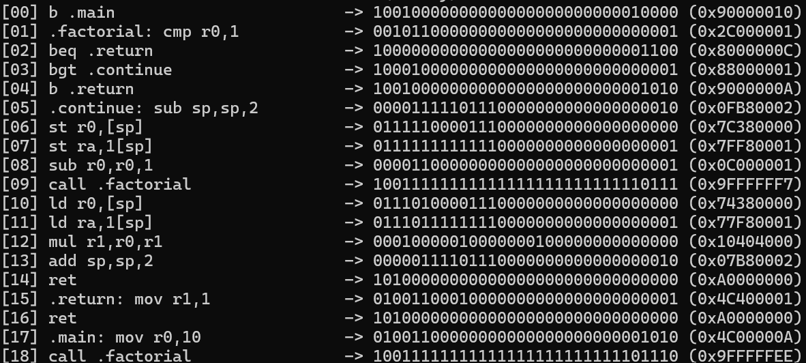
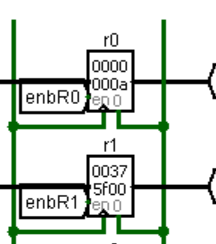
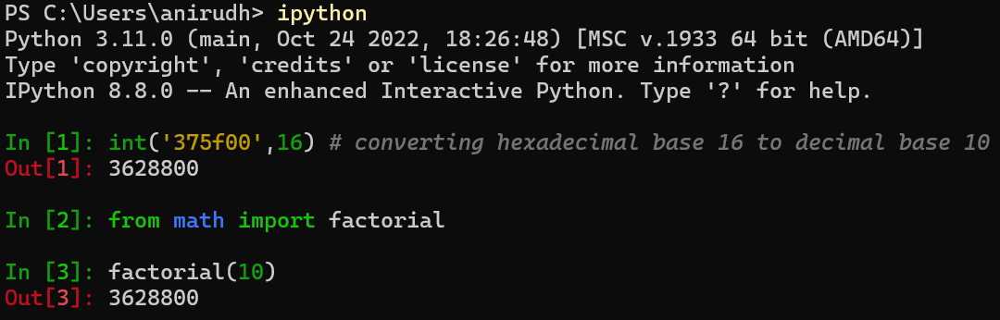

# 🖥️ Simple RISC CPU — Logisim Implementation


An implementation of the SimpleRISC CPU in Logisim, inspired by IIT Delhi
Prof. Smruti Sarangi's course on Computer Architecture.

- **Course page:** https://www.cse.iitd.ac.in/~srsarangi/archbooksoft.html
- **YouTube playlist:** https://www.youtube.com/playlist?list=PL1iLu2CSC9EWAo0ysorNI_nebwF6Rwkr0
- **Book (PDF):** https://www.cse.iitd.ac.in/~srsarangi/archbook/archbook.pdf
- **High-level design doc:** [simple_risc_cpu_high_level_doc.pdf](simple_risc_cpu_high_level_doc.pdf)

## Table of Contents
- [Demo](#demo)
- [Circuit Diagrams](#circuit-diagrams)
- [Instruction Set Architecture](#instruction-set-architecture)
- [Instruction Encoding](#instruction-encoding)
- [Running the Factorial Program](#running-the-factorial-program)
- [Project Files](#project-files)
- [Getting Started](#getting-started)

## Demo

Recursive factorial(10) executing on the CPU in Logisim:


### Circuit Diagrams

| Top-Level CPU | ALU |
|---|---|
|  |  |

| Control Unit | Register File |
|---|---|
|  |  |

## Instruction Set Architecture

16 general-purpose registers (`r0`-`r15`), with `r14`/`sp` as stack pointer and `r15`/`ra` as return address register.

| Mnemonic | Opcode | Format | Description |
|---|---|---|---|
| `add` | `00000` | Reg/Imm | rd = rs1 + rs2/imm |
| `sub` | `00001` | Reg/Imm | rd = rs1 - rs2/imm |
| `mul` | `00010` | Reg/Imm | rd = rs1 * rs2/imm |
| `div` | `00011` | Reg/Imm | rd = rs1 / rs2/imm |
| `mod` | `00100` | Reg/Imm | rd = rs1 % rs2/imm |
| `cmp` | `00101` | Reg/Imm | compare rs1, rs2/imm (sets flags) |
| `and` | `00110` | Reg/Imm | rd = rs1 & rs2/imm |
| `or`  | `00111` | Reg/Imm | rd = rs1 \| rs2/imm |
| `not` | `01000` | Reg/Imm | rd = ~rs2/imm |
| `mov` | `01001` | Reg/Imm | rd = rs2/imm |
| `lsl` | `01010` | Reg/Imm | logical shift left |
| `lsr` | `01011` | Reg/Imm | logical shift right |
| `asr` | `01100` | Reg/Imm | arithmetic shift right |
| `nop` | `01101` | Branch | no operation |
| `ld`  | `01110` | Immediate | rd = mem[rs1 + imm] |
| `st`  | `01111` | Immediate | mem[rs1 + imm] = rd |
| `beq` | `10000` | Branch | branch if equal |
| `bgt` | `10001` | Branch | branch if greater than |
| `b`   | `10010` | Branch | unconditional branch |
| `call`| `10011` | Branch | ra = PC+1, branch |
| `ret` | `10100` | Branch | PC = ra |

> ALU ops also support `u` (unsigned) and `h` (high/upper-half) modifier suffixes,
> e.g. `addu`, `subh` — encoded via 2 modifier bits in the immediate field.

## Instruction Encoding

All instructions are 32 bits wide, in one of three formats:

```
Branch Format:
┌──────────┬─────────────────────────────────────────┐
│  opcode  │                 offset                  │
│  5 bits  │                 27 bits                 │
└──────────┴─────────────────────────────────────────┘

Immediate Format:
┌──────────┬───┬────────┬────────┬─────┬──────────────┐
│  opcode  │ I │   rd   │  rs1   │ mod │  immediate   │
│  5 bits  │ 1 │ 4 bits │ 4 bits │ 2 b │   16 bits    │
└──────────┴───┴────────┴────────┴─────┴──────────────┘

Register Format:
┌──────────┬───┬────────┬────────┬────────┬────────────┐
│  opcode  │ I │   rd   │  rs1   │  rs2   │  (unused)  │
│  5 bits  │ 1 │ 4 bits │ 4 bits │ 4 bits │  14 bits   │
└──────────┴───┴────────┴────────┴────────┴────────────┘
```

## Running the Factorial Program

Recursive factorial implemented in SimpleRISC assembly
(`factorial_simple_risc_assembly_recursive.txt`):

```asm
b .main
.factorial: cmp r0,1
beq .return
bgt .continue
b .return
.continue: sub sp,sp,2
st r0,[sp]
st ra,1[sp]
sub r0,r0,1
call .factorial
ld r0,[sp]
ld ra,1[sp]
mul r1,r0,r1
add sp,sp,2
ret
.return: mov r1,1
ret
.main: mov r0,10
call .factorial
```

Assembling factorial(10) to binary/hex:



The result is stored in `r1`. Circuit output at the end of the program:



Cross-checking the hex value in `r1` against Python's `math.factorial(10)`:



The Simple RISC CPU circuit output matches the expected value. ✅

## Project Files

| File | Description |
|---|---|
| `my_simple_risc_cpu.circ` | Logisim circuit — open this to run the CPU |
| `simple_risc_assembler_with_modifiers.py` | Python assembler: SimpleRISC assembly → binary/hex |
| `factorial_simple_risc_assembly_recursive.txt` | Recursive factorial program in SimpleRISC assembly |
| `logisim_simple_risc_assembly_hex_factorial_recursive` | Assembled hex machine code for the factorial program |
| `simple_risc_cpu_high_level_doc.pdf` | High-level architecture/design documentation |
| `simple_risc_cpu_circuit_images/` | Screenshots of the CPU, ALU, Control Unit, and Register File sub-circuits |
| `GATE Cache Solved PYQs.pdf` | Solved GATE previous-year questions on cache memory |
| `GATE Pipeline Solved PYQs.pdf` | Solved GATE previous-year questions on pipelining |
| `logisim-win-2.7.1.exe` | Logisim installer (Windows) used to build/run the circuit |

## Getting Started

1. Install [Logisim](http://www.cburch.com/logisim/) (or use the bundled `logisim-win-2.7.1.exe`).
2. Open `my_simple_risc_cpu.circ` in Logisim.
3. Load the hex machine code (`logisim_simple_risc_assembly_hex_factorial_recursive`) into instruction memory.
4. Step/tick the clock to execute and watch register values update.

To assemble your own SimpleRISC program:

```bash
python simple_risc_assembler_with_modifiers.py
```
