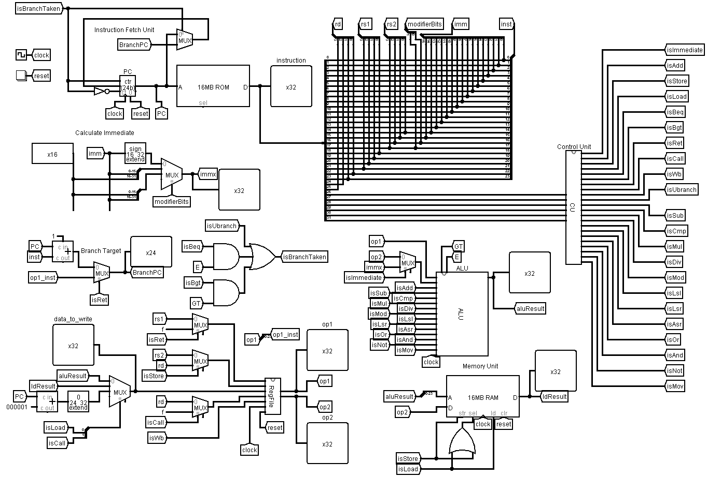

This is an implementation of Simple RISC CPU in logisim inspired from IIT Delhi Prof Smruthi Sarangi course on Computer Architecture. 

Course page: https://www.cse.iitd.ac.in/~srsarangi/archbooksoft.html

YouTube Playlist: https://www.youtube.com/playlist?list=PL1iLu2CSC9EWAo0ysorNI_nebwF6Rwkr0

Book: https://www.cse.iitd.ac.in/~srsarangi/archbook/archbook.pdf

converting factorial of 10 program in simple risc assembly to binary and hex:

from program its visible that the final result is stored in register r1, here is the circuit output by the end of program:

there is an hex value in r1, and that is equal to 

ok we got value of 3628800, lets cross check if it is really factorial of 10 via python 

great, our Simple RISC CPU circuit output matches the intended value.
